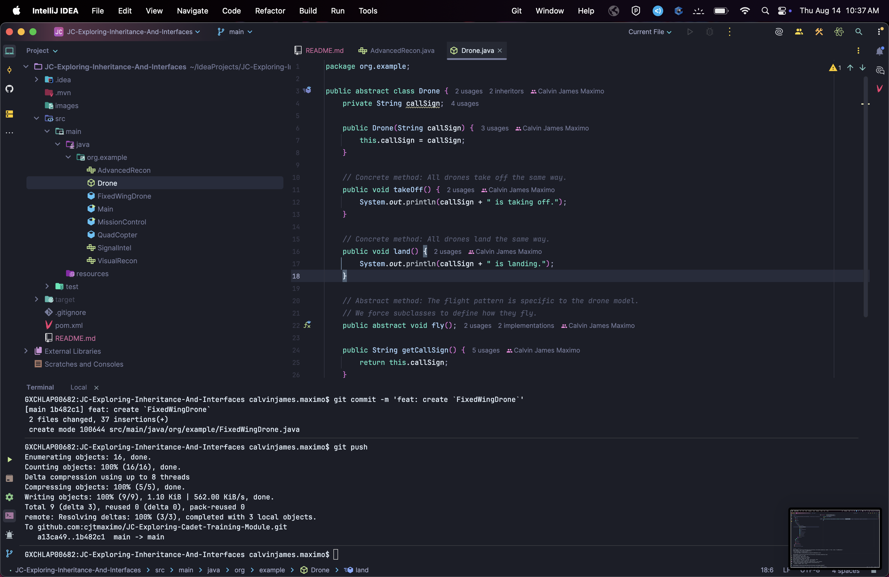
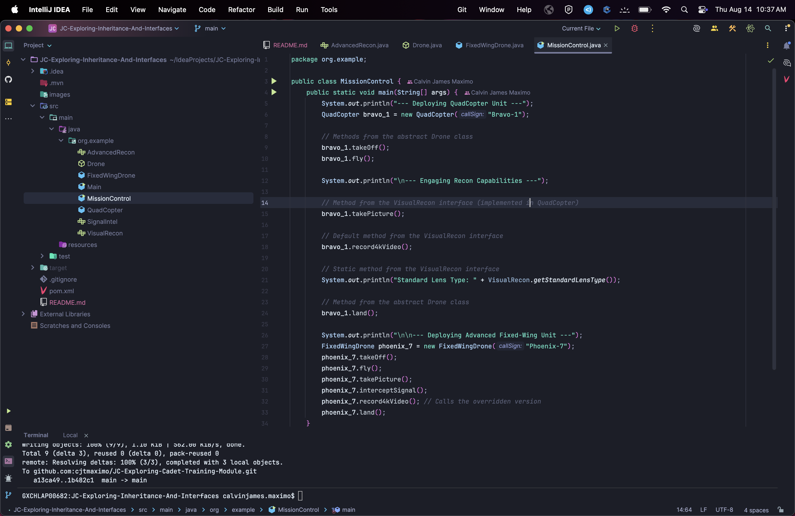
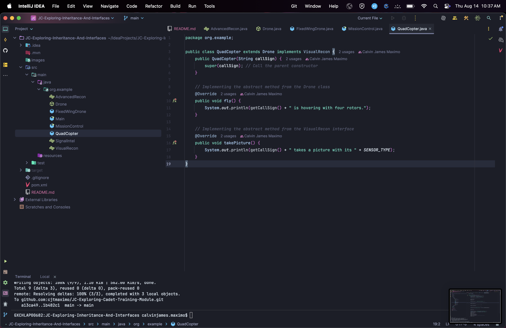
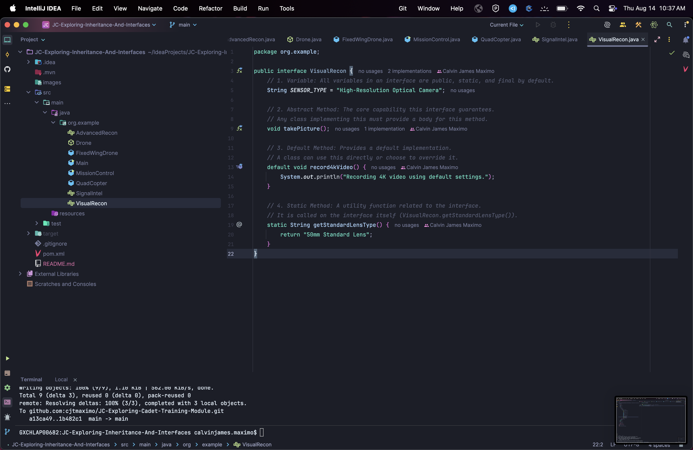

Maximo, Calvin James T. 
Cadet Training Module: Java Inheritance and Interfaces 
### Screenshots of classes & interfaces
#### `AdvancedRecon` interface

#### `Drone` class

#### `FixedWingDrone` class

#### `MissionControl` class

#### `QuadCopter` class

#### `SignalIntel` interface

#### `VisualRecon` interface
